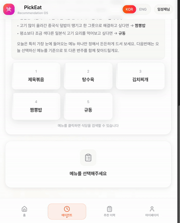
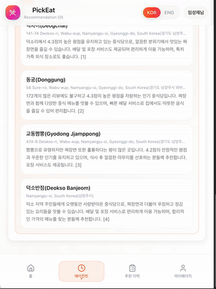
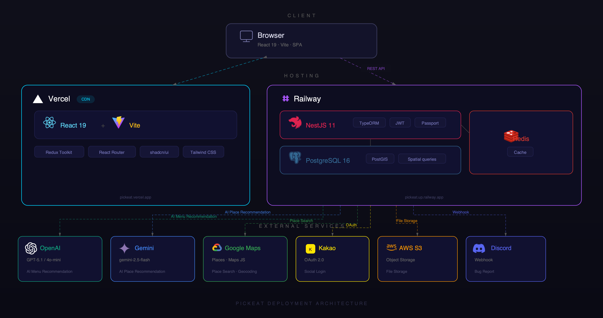
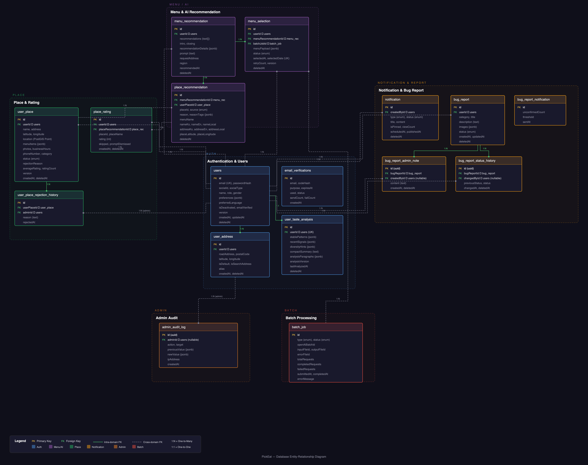

<div align="center">

# PickEat Backend

**AI 기반 맞춤형 메뉴 추천 서비스의 백엔드 API 서버**

[www.pick-eat-fe-web.vercel.app](https://www.pick-eat-fe-web.vercel.app)


[프로젝트 개요](#프로젝트-개요) · [주요 기능](#주요-기능) · [기술 스택](#기술-스택) · [아키텍처](#아키텍처) · [ERD](#erd) · [시작하기](#시작하기) · [문서](#문서)

</div>

---

## 프로젝트 개요

<div align="center">
  
</div>

<br>

매일 반복되는 "오늘 뭐 먹지?"라는 고민,
기존 서비스에서는 사용자 취향을 반영한 메뉴 추천을 제공하지 못하는 문제가 있습니다.

**PickEat**은 이 문제를 해결하기 위한 프로젝트로,
OpenAI GPT와 Google Gemini를 결합하여
**"취향 분석 → 메뉴 추천 → 맛집 탐색"** 까지의 흐름을 하나의 서비스로 제공합니다.

- 사용자의 식사 패턴을 AI가 자동으로 분석하여 선호도를 학습하고
- 학습된 취향과 유저의 요청사항을 분석하여 맞춤 메뉴를 실시간 스트리밍으로 추천하며
- 추천된 메뉴를 먹을 수 있는 등록된 주소 근처의 맛집까지 검색해줍니다

---

## 주요 기능

<table>
<tr>
<td align="center" width="50%">

<br/>
<b>취향 설정</b>
<br/>
<sub>음식 취향, 알레르기, 식사 스타일 등을 설정하여 AI 메뉴 추천의 기반 데이터를 구성합니다.</sub>
</td>
<td align="center" width="50%">

<br/>
<b>AI 메뉴 추천</b>
<br/>
<sub><code>GPT-5.1</code> 2단계 파이프라인으로 맞춤 메뉴를 추천하고, <code>SSE</code> 스트리밍으로 실시간 응답합니다.</sub>
</td>
</tr>
<tr>
<td align="center" width="50%">

<br/>
<b>맛집 추천</b>
<br/>
<sub><code>Gemini Maps Grounding</code>과 <code>Google Places API</code>를 연동하여 주변 맛집을 검색하고 추천합니다.</sub>
</td>
<td align="center" width="50%">

<br/>
<b>가게 상세</b>
<br/>
<sub>AI가 작성한 가게 설명, 평점, 리뷰 요약을 제공합니다.</sub>
</td>
</tr>
</table>

---

## 기술 스택

### Backend


### DB / Cache


### AI / LLM


### External API


### Infra / Test


---

## 아키텍처



**Layer**: Controller (요청/응답) → Service (비즈니스 로직) → Repository (데이터) / Client (외부 API)

---

## ERD



---

## 시작하기

### 사전 요구사항

- **Node.js** >= 20
- **pnpm**
- **Docker** (PostgreSQL + PostGIS, Redis용)

### 설치

```bash
# 저장소 클론
git clone https://github.com/LSJ0621/PickEat_BE.git
cd PickEat_BE

# 환경 변수 설정
# .env.example 파일에 API 키(OpenAI, Google, Kakao, AWS S3 등)를 입력하세요

# 의존성 설치
pnpm install

# Docker로 PostgreSQL + PostGIS, Redis 실행
docker-compose up -d

# 개발 서버 실행
pnpm run start:dev    # → http://localhost:3000
```

---

## 문서

| 문서 | 설명 |
|------|------|
| [Architecture](docs/architecture.md) | 시스템 아키텍처 및 데이터 흐름 |
| [Backend Structure](docs/backend-structure.md) | 모듈별 구조 및 레이어 설명 |
| [Database Schema](docs/database-schema.md) | 13개 테이블 스키마 및 관계 |
| [API Reference](docs/api-reference.md) | 75개 엔드포인트 명세 |
